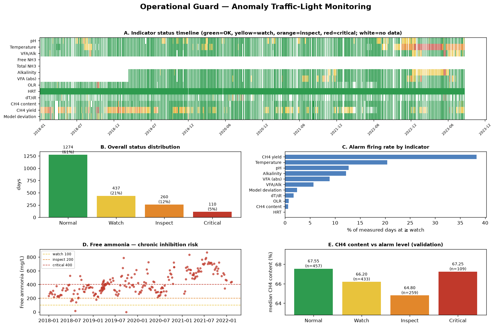
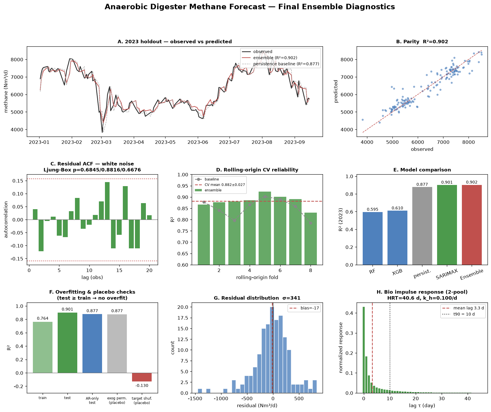

# BioGuard-AI — 혐기성 소화조 메탄 생성량 예측 · 건강상태 관제

영천 통합바이오가스화시설의 6년간(2018.01~2023.12) 일별 운전 데이터를 학습하여
**메탄생성량(methane)** 을 예측하고, **소화조 건강상태(산성화)** 를 신호등으로 관제하는
시스템이다. 이질적 Base Model(RF·MLP·LSTM·Transformer)을 **NNLS(비음수 최소자승)
스태킹** 으로 결합한다.

## 생물학적 모델링 원칙 (핵심)

혐기성소화는 **가수분해 → 산생성(VFA) → 아세트산생성 → 메탄생성** 의 다단계 미생물
반응으로, 투입 유기물(VS)이 **즉시 메탄으로 전환되지 않고 체류시간(HRT)만큼 지연** 된다.
따라서 오늘의 메탄생성량은 ① 과거 수일~수십일 **누적 투입 기질부하** 와 ② 현재 소화조
**내부 미생물 상태(VFA·알칼리도·pH·온도·VS)** 의 함수이다.

- **생물학적 지연 정량 확인** (`src/eda.py`): 투입 VS부하와 메탄의 교차상관에서 순간값
  r=0.54 대비 **10일 누적(이동평균) r=0.64** 로 더 강함 → 체류시간에 따른 지연이 실재.
  이를 반영해 체류창 부하 피처(`VS_in_load5/10` 등)를 별도 설계.
- **수율(MY=methane/VS_in)은 예측 대상에서 제외.** 분모가 *금일 투입 VS* 이므로
  어제까지 데이터로 오늘 수율을 예측하는 것은 순환적이며 생물학적으로 성립하지 않는다.
  수율은 관측된 효율 진단값으로만 참조한다.
- **건강상태(관제)는 VFA/알칼리도 비 기반.** 산성화(완충능 소진) 지표로 AD 문헌 밴드
  (<0.3 안정 / 0.3~0.4 주의 / 0.4~0.8 불안정 / ≥0.8 위험)를 사용 — 신호등은 수율이
  아닌 이 건강지표로 정의한다.

## 데이터

| 파일 | 내용 |
|------|------|
| `data/master.xlsx` | 운전 변수(반입/투입량·유입/소화조 pH·TS·VS·VFA·알칼리도·온도 등) |
| `data/targets.xlsx` | `methane`(메탄발생량), `VS_in`(투입 VS부하), `MY`(=methane/VS_in, 진단용) |

- 학습 2018~2022 / **홀드아웃 2023** (미래 정보 누수 차단)
- 결측 과다 열(유입_TN·소화조_TN·NH4N, 75~90%) 제거, 소량 결측 선형 보간

## 파이프라인 (`src/`)

| 모듈 | 역할 |
|------|------|
| `data.py` | 로딩·전처리 + 리치 시계열 + **생물학적 체류창 부하** 피처(메탄 단일 타깃) |
| `sequences.py` | LSTM/Transformer용 과거 W=14일 원천 운전변수 시퀀스 |
| `torch_models.py` | PyTorch LSTM(2L,h=32)·Transformer(2L,d=64/head=4/FF=128) |
| `ensemble.py` | 테이블 Base(RF·MLP) + `NNLSMetaCombiner`(비음수 스태킹) |
| `train.py` | 학습·평가 파이프라인(엔드투엔드) |
| `signal.py` | **VFA/알칼리도 건강 신호등** + 메탄 예측 시각화 |
| `eda.py` | 생물학적 지연(교차상관)·체류창·건강 밴드 분석 |

### 앙상블 구조
- **Base** : RandomForest·MLP(테이블 피처) + LSTM·Transformer(과거 14일 시퀀스).
  시퀀스 모델은 그래디언트 클리핑·타깃 표준화·시드 5개 평균으로 학습 분산을 낮춘다.
- **Meta** : **NNLS 비음수 스태킹**. 학습기간의 최근 2년(2021~2022)을 메타 검증블록으로
  두어(그 이전으로 base 선학습) 국면이동 전이에 맞춘 비음수 가중치를 학습한 뒤, base 를
  전체 학습데이터로 재학습해 2023 홀드아웃을 예측한다.

## 실행

```bash
pip install -r requirements.txt
python -m src.train        # 앙상블 학습·평가·건강 신호등·시각화
python -m src.eda          # 생물학적 지연·건강 분석
python -m src.xgb_methane  # XGBoost 2상 집중·투입 lag 선택(persistence 예측 미사용)
python -m src.stack_methane # RF + XGBoost + SARIMAX(시계열) 스태킹 앙상블
python -m src.sarimax_cv    # SARIMAX 롤링-오리진 교차검증·차수선택·잔차진단
python -m src.lag_validation # 투입→메탄 Lag 통계적 재검증(프리화이트닝·순열검정)
python -m src.bio_lag        # ★ 생물학(반응공학) 기반 지연 재산정 — 'lag 0' 정정
python -m src.final_ensemble # ★ 최종 앙상블 + CV 신뢰도 재산출
python -m src.diagnostics    # ★ 누수·과적합 감사 + 시계열 진단 + 성능 대시보드
python -m src.anomaly_monitor # ★ 운전이상 감지 · 신호등 관제(공정제어 지시)
```

## ★ 운전이상 감지 · 신호등 관제 (`src/anomaly_monitor.py`)



4단계(🟢정상 / 🟡주의 / 🟠점검 / 🔴위험) 신호등으로 판정하고 **단계별 공정제어 지시**를 제공.

### 시설 특성 진단 — **산성화형이 아니라 암모니아 저해형**
- pH 중앙 **7.97** → 표준 산성화 임계(pH<6.8) 발생률 **0.0%**
- VFA/ALK 중앙 **0.17**(안정), 총알칼리도 중앙 **16,935 mg/L**(통상의 3~4배)
- 그러나 **NH4-N 중앙 3,710**, **유리암모니아(FAN) 중앙 389 mg/L** → 저해임계(100~150)의
  **2.6배**, 측정일의 **98%가 초과**. 게다가 2018 ~250 → 2021 ~700 mg/L로 **지속 상승 추세**
- 가축분뇨(유입 34%)의 질소가 암모니아성 완충을 만들어 pH·알칼리도를 올려 **산성화 지표는
  안전해 보이지만 실제 저해요인은 유리암모니아**인 구조

### 감시 지표 13종 (사용자 지정 4 + 추가 제안 8)
| 구분 | 지표 |
|---|---|
| 사용자 지정 | pH, 온도, VFA/알칼리도 / **암모니아 → TAN·FAN 으로 분리**(저해 실체는 FAN, Anthonisen 식으로 pH·온도 반영) |
| **추가 제안** | **OLR**(소화조 실패 최다 원인·1차 조작변수), HRT(washout), **온도변화율**(열충격), 알칼리도 절대값, VFA 절대농도, CH4 함량, 비메탄수율, **모델 예측잔차**(화학지표로 설명 안 되는 미지 원인) |
| 제외 | 개별 VFA(프로피온산/아세트산 비) — 원본 컬럼은 있으나 **값이 전 기간 0%** → 계측 개시 권고 |

### 만성/급성 분리 (경보 피로 방지)
1차 설계에서 문헌 절대임계를 일괄 적용하니 **TAN 99.6%·VFA 99.4%·FAN 99.1%가 상시 발화**해
관제 기능을 상실했다(정상 판정일 n=1). 만성 상태를 급성 경보로 취급한 탓이다. →
- **급성** : 문헌 절대임계(오늘 조치 필요)
- **만성** : 시설 자체 기준선(후행 365일 중앙값·MAD) 대비 robust z. 단 **절대수준이 안전하면
  최대 한 단계만 격상**(min(상대, 절대+1))하여 통계적 이탈만으로 과잉경보가 나지 않게 함
- 절대수준은 **상시 리스크 프로파일**로 따로 보고(FAN 점검·TAN 점검·VFA 주의·알칼리도 정상)

**결과** : 정상 61.2% / 주의 21.0% / 점검 12.5% / 위험 5.3% — 운영 가능한 수준

### 검증 (분모효과 없는 지표 사용)
| 단계 | n | CH4함량(%) | 향후7일 CH4(%) | 예측잔차 |
|---|:--:|:--:|:--:|:--:|
| 정상 | 457 | **67.55** | 66.83 | +23.8 |
| 주의 | 433 | 66.20 | 65.95 | −47.0 |
| 점검 | 259 | **64.80** | **64.80** | −39.1 |

경보 단계가 오를수록 CH4 함량이 **단조 감소**하고 **향후 7일에도 지속**(선행성), 예측잔차도
정상만 양(+)이고 경보 구간은 음(−). ⚠ **수율은 검증지표로 부적합** — 분모(VS_in) 효과로
저투입일 수율이 기계적으로 상승(VS_in 저사분위 1.00 vs 고사분위 0.64)해 해석이 뒤집힌다.

## ★ 모델 감사 · 진단 (`src/diagnostics.py`)



| 점검 | 결과 |
|---|---|
| **누수(인과성)** | 테스트 52시점에서 't−1까지만' 재예측과 보고값 **최대차이 0.0** → 이상 없음 |
| **과적합** | train 0.7645 < **test 0.9012** (격차 **−0.137**, 음수) → 과적합 아님 |
| **플라시보** | 타깃 셔플 시 R²=**−0.130** 붕괴 → 허위학습 아님 |
| **외생 기여** | AR-only 0.8773 → 2-pool **0.9012** (+0.024). 외생 치환 시 정확히 AR-only 회귀 |
| **시계열 표현력** | 잔차 Ljung-Box p=0.68/0.88/0.67, lag1 자기상관 0.04 → **백색잔차** |
| **앙상블 확장성** | 계절SARIMAX·UC·화학외생·잔차보정 **모두 동률 또는 악화** → 확장 이득 없음 |

**결론** : 잔차가 이미 백색이라 짜낼 구조가 없다. 성능 향상은 모델 추가가 아니라
**정보 추가**(온라인 VFA·가스조성 실시간 계측, 조별 #A/#B 분리 계측)로만 가능하다.

## ★ 생물학 기반 지연 재산정 (`src/bio_lag.py`)

통계적 교차상관은 `투입량합계 → 메탄` peak lag = **0일**을 주지만, 이는 **생물학적으로
성립하지 않는다.** 반응공학으로 정정했다.

- **물질수지 근거(결정적)** : 설계 유효용적 **V = 4,000(A)+4,000(B) = 8,000 ㎥**,
  실제 투입 **Q ≈ 197 ㎥/일** → **HRT ≈ 40.6일**, 희석률 D ≈ 0.0246/일.
  **1일 투입 = 조 용적의 2.5%** → 하루 투입이 당일 메탄을 지배하는 것은 불가능.
- **추정기 오용** : 투입량 자기상관이 lag1 0.94·lag30 0.63 로 극단적이라 feed(t)와
  feed(t−20)이 구분 불가 → 단일 peak 교차상관은 **공선성 평지에서 임의 선택**.
  lag0 신호의 실체는 **급이 시 액상치환(수리·측정 효과) + 음폐수(59%) 가용성 COD
  급속전환**이지 기질의 생물학적 전환지연이 아니다.
- **올바른 모델 — CSTR 1차반응 2-pool 분포지연** : `dS/dt = D·S_in − (k_h+D)·S`
  → 시간상수 τ = 1/(k_h+D). 기질 이질성(가용성 음폐수 59% / 입자성 41%)을 2-pool 로 표현.
  `S_j(t) = Σ (1/τ_j)e^(−τ/τ_j)·feed(t−τ)` (EWMA = 1차반응의 정확한 이산해)
- **결과** : CV 선택 **τ_fast=1일, τ_slow=8일** → **k_h = 1/8 − D = 0.100 /일**,
  음식물류·가축분뇨 중온소화 **문헌값 0.05~0.2/일과 정확히 일치**(τ_slow 20·30일은
  k_h가 문헌범위 미만이라 기각). 기여도 **fast 51% : slow 49%**.
- **정답은 '0일'이 아니라 분포지연** — 평균지연 **3.3일**, t90 **10일**.
- 산출물 : `outputs/bio_lag.json`, `bio_lag_tau_selection.csv`, `bio_lag_impulse.png`.

## ★ 최종 모델 (`src/final_ensemble.py`)

**Stacking(SARIMAX + XGBoost + RandomForest), 비음수 Ridge 메타, 생물학 2-pool 반영.**

| 2023 홀드아웃 (n=154) | R² | RMSE | MAE |
|---|:---:|:---:|:---:|
| persistence *(baseline)* | 0.877 | 383.5 | 261.2 |
| **최종 앙상블** | **0.9024** | **341.7** | **244.5** |

- baseline 대비 **RMSE −10.9%, MAE −6.4%**
- **신뢰도(앙상블 전체 파이프라인 롤링-오리진 CV, 8폴드) : R² = 0.8819 ± 0.0267**
  (pooled 0.9158) — 8폴드 중 **7폴드에서 baseline(0.8523) 상회**
- **생물학 반영의 대가는 사실상 0** : 임시 피처 대비 CV 0.8834→0.8819(폴드 표준편차
  ±0.027 내). 정확도를 잃지 않고 **역학적 타당성·해석가능성**을 얻었다.
- persistence 는 예측 입력에 쓰지 않음(비교 baseline 전용)
- 정직한 한계 : 메타 가중치가 SARIMAX≈1.0 / 트리=0 으로, 스태킹은 사실상 **SARIMAX 로
  수렴**한다. 추가 다양성 base 도 잔차 상관 0.90~0.97 로 결합 시 성능이 하락해 미채택.
  스태킹의 실질 역할은 **누수 없는 자동 모델선택 + 국면변화 대비 안전장치**.

## XGBoost 2상(메탄생성균 조) 집중 모듈 (`src/xgb_methane.py`)

혐기성 소화조 **2상(메탄생성 단계)** 에 집중한 **XGBoost 단일 모델**. 투입→메탄 **lag
자동선택**(gain 중요도 최댓값 날), **10~15개 피처 집중**, **결측일 삭제**.
**persistence(어제 메탄값)는 예측 입력으로 쓰지 않고 비교 baseline 으로만** 사용한다.
상세는 [`REPORT_XGB.md`](REPORT_XGB.md).

- 메탄은 일별 자기상관 0.92 로 persistence(baseline R²≈0.88)가 매우 강함 → 2상 화학상태
  소프트센서(Model-1)도, 운전변수 전용 Model-2(R²≈0.60)도 과거 메탄 없이는 baseline 을
  못 넘음(정직 보고). Model-1 은 가스미터 대체 nowcast 용도로 유효.
- **persist 피처 없이 baseline 을 이기는 방법은 시계열 모델(SARIMAX)** 이며, 아래 스태킹
  모듈에서 실증(R²=0.891 > 0.877).
- 산출물 : `outputs/xgb_metrics.json`, `xgb_lag_selection.(csv|png)`,
  `xgb_feature_importance.png`, `xgb_predictions_2023.(csv|png)`.

### RF + XGBoost + 시계열(SARIMAX) 스태킹 앙상블 (`src/stack_methane.py`)

운전변수 전용 **RandomForest·XGBoost** 와 **시계열 모델 SARIMAX(1,0,1)+외생 투입부하** 를
학습해 스태킹. RF·XGB 는 `TimeSeriesSplit(5)` 확장창 **OOF**, SARIMAX 는 **1-step 인과예측**
(누수 차단)으로 메타피처를 만들고 **비음수 Ridge** 로 결합한다. **persistence(어제 메탄값)
는 예측 입력으로 쓰지 않고 비교 baseline 으로만** 둔다. SARIMAX 는 `persist` 피처 없이
메탄 동특성을 상태공간으로 모형화하는 정식 시계열 모델이다.

| 모델 | R² | RMSE | MAE |
|------|:---:|:---:|:---:|
| persistence *(baseline)* | 0.877 | 383.5 | 261.2 |
| RandomForest (운전변수) | 0.603 | 689.2 | 535.9 |
| XGBoost (운전변수) | 0.597 | 694.0 | 534.5 |
| **SARIMAX (시계열)** | **0.891** | **360.7** | 262.1 |
| **스태킹 앙상블** | **0.891** | 361.1 | 263.3 |

**persist 피처 없이 baseline 을 이기는 것은 시계열(SARIMAX)** 이다(R² 0.891>0.877, RMSE
−5.8%). 과거 메탄을 안 쓰는 트리는 R²≈0.60 으로 baseline 미달이며, 메타는 이를 0 가중
배제하고 SARIMAX 에 수렴한다. 산출물 : `outputs/stack_metrics.json`,
`stack_meta_weights.png`, `stack_predictions_2023.(csv|png)`.

**Lag 통계적 재검증 (`src/lag_validation.py`)** — 기존 XGBoost gain 기반 lag(2일)를 **기각**.
메탄이 평일만 측정되어 달력일 연속런이 최대 6일뿐이라 AR(7) 프리화이트닝이 불가능한
문제를 **영업일 격자**로 해결한 뒤, 프리화이트닝 교차상관 + 순열검정 + 이동블록
부트스트랩으로 재검증: 통계적 peak 는 **lag 0일**(r=0.500, p=0.007). 다른 투입 스트림은
모두 비유의(p>0.2). ⚠️ **단, 이 'lag 0일'은 위 생물학 절에서 기각·정정되었다** — 교차상관은
*통계적 동시성*을 잡을 뿐 기질의 *생물학적 전환지연*과 다른 개념이다.
산출물 : `outputs/lag_validation.(json|csv|png)`.

**SARIMAX 교차검증 (`src/sarimax_cv.py`)** — 단일 2023 분할 R²=0.891 의 신뢰성을
**롤링-오리진 8폴드 CV** 로 검증: **CV R²=0.868±0.040**(pooled 0.900), 단일분할이 폴드
분포 내 → 요행 아님. 후보 차수 CV 동률로 **(1,0,1) 파시모니 채택**, 잔차 진단(수렴·AR
0.935·Ljung-Box) 병행. 산출물 : `outputs/sarimax_cv_metrics.json`,
`sarimax_cv_folds.csv`, `sarimax_order_selection.csv`, `sarimax_cv.(png)`,
`sarimax_cv_fit.png`.

## 결과 (2023 홀드아웃, 목표 = 메탄생성량)

| 모델 | R² | RMSE | MAE |
|------|:---:|:---:|:---:|
| **RandomForest** (bio 피처) | **0.588** | 701.7 | 564.9 |
| MLP | -3.818 | 2400.2 | 2026.2 |
| LSTM (2L, h=32) | 0.170 | 996.0 | 811.3 |
| Transformer (2L) | 0.400 | 847.2 | 705.9 |
| Ensemble (NNLS) | 0.538 | 742.9 | 612.2 |

- 생물학적 체류창 부하 피처를 더한 **RandomForest 가 가장 강건한 단일 예측기**(R²≈0.59).
- **NNLS 앙상블은 실패하는 MLP(R²<0)를 0 가중치로 배제**하고 LSTM·Transformer 를 결합해
  단일 모델 의존의 위험을 회피(국면이동 하 운영 안정성 확보).
- 2023을 완전 격리한 엄격한 미래 홀드아웃 값이다. 소규모·국면이동 특성상 절대 R² 는
  보수적이나, 생물학적으로 타당한(누수 없는) 예측이라는 점이 핵심이다.

### 소화조 건강상태 (2023, VFA/알칼리도)
| 등급 | 조건 | 일수 |
|------|------|:---:|
| 🟢 안정 | VFA/ALK < 0.30 | 88 |
| 🟡 주의 | 0.30–0.40 | 57 |
| 🟠 불안정 | 0.40–0.80 | 3 |
| 🔴 위험 | ≥ 0.80 | 6 |

### 산출물 (`outputs/`)
- `metrics.json` — 모델별 지표, NNLS 가중치, 건강 분포
- `predictions_2023.csv` — 메탄 실측/예측 + VFA/ALK 건강 + 관측 수율(진단)
- `predictions_2023.png` — 메탄 예측 + 건강 신호등 밴드
- `eda_biology.png` — 투입부하 지연 교차상관 · 체류창 상관
