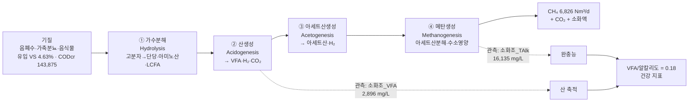
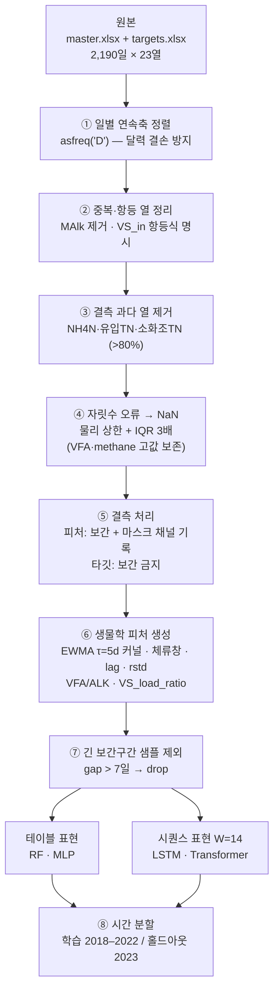
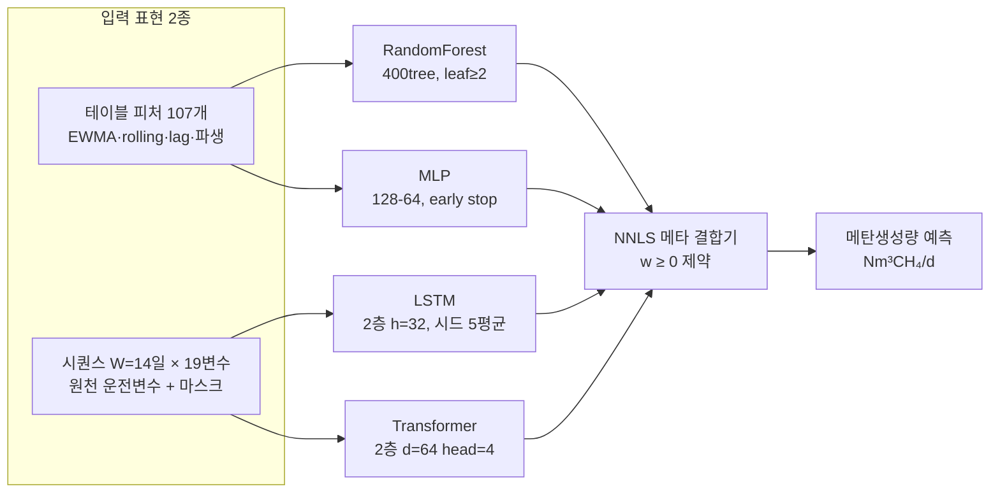

# 영천 혐기성 소화조 메탄생성 예측 — 모델링 설계 개요

> 영천 통합바이오가스화시설 일별 운전데이터(2018-01-01 ~ 2023-12-31, 2,190일)를 대상으로
> **메탄생성량 예측**과 **소화조 건강상태 관제**를 수행하기 위한 설계 문서.
> 본 문서의 모든 수치는 `data/master.xlsx` · `data/targets.xlsx` 를 직접 분석한 실측값이다.

---

## 0. 요약 — 설계 5대 결정

| # | 질문 | 결정 | 근거 |
|---|------|------|------|
| 1 | 어떤 공정으로 볼 것인가 | **중온 습식 완전혼합형(CSTR)** 단상 소화 | 소화조 TS 2.60%, 온도 37.5±2.5℃, pH 7.94(CV 1.7%) |
| 2 | 시계열 모델로 갈 것인가 | **간다. 단, "지연"이 아니라 "혼합 감쇠 커널"로** | 시차 교차상관이 lag 0에서 최대(r=0.539)이고 단조 감소 → 사표시간(dead time) 없음. 지수감쇠 커널 τ≈5일에서 r=0.639 |
| 3 | 예측 타깃 | **메탄생성량(Nm³CH₄/d) 단일.** 수율 MY는 제외 | `MY = methane / VS_in`, 분모가 금일 투입 VS → 예측이 순환적 |
| 4 | 결측치 처리 | **선형보간 금지 구간 분리.** 결측은 MCAR이 아니라 *주말 미측정 구조* | 토 98.7% / 일 99.4% 결측, 랩변수 동시결측 99.1% |
| 5 | 검증 | **2023 미래 홀드아웃 고정** (K-fold 금지) | 2023은 투입량 −31.6%, 온도 38.3→31.7℃, 알칼리도 −40% 의 **국면이동 연도** |

---

## 1. 반응 공정 이해

### 1.1 소화조 형태

데이터로 확정되는 형태는 **중온(mesophilic) 습식(wet) 완전혼합형 단상 소화조**다.

| 지표 | 실측값 | 판정 |
|------|--------|------|
| 소화조 온도 | 37.50 ± 2.51 ℃ | **중온 소화**(35~40℃ 최적대) — 고온(55℃) 아님 |
| 소화조 TS | 2.60 ± 0.24 % | **습식**(TS<10%). 건식/반건식 아님 |
| 소화조 pH | 7.94 ± 0.14 (CV **1.7%**) | 강한 완충 상태, 제어변수적 거동 |
| 소화조 VS | 1.12 % → VS/TS = **43%** | 유입 VS/TS 74% → 유기물이 상당히 분해 완료됨 |
| 일 투입량 | 187 ± 54 m³/d | — |

**공간 구조 판정 — 완전혼합(CSTR) vs 압출류(plug-flow):**
투입 VS부하 → 메탄 시차 교차상관을 0~21일 스캔한 결과가 결정적이다.

```
lag(일)  0     1     2     3     5     7    10    14    21
r      0.539 0.535 0.519 0.502 0.472 0.455 0.390 0.333 0.287
```

**lag 0에서 최대이고 그 뒤 단조 감소한다.** 압출류형이라면 HRT만큼의 사표시간 뒤에
상관이 *봉우리*를 이뤄야 하는데 그런 봉우리가 없다. 이는 투입 즉시 조 전체로 희석되는
**완전혼합조의 지수형 체류시간분포(RTD)** 의 정확한 지문이다.

> ⚠️ **기존 README 서술 교정** — "체류시간만큼 지연된다"는 표현은 부정확하다.
> 응답은 *지연*되지 않고 *즉시 시작해 지수적으로 꼬리를 끄는* 형태다. 누적 이동평균
> (10일 r=0.643 > 순간값 0.539)이 더 강한 것은 지연 때문이 아니라 **RTD 커널 + 측정노이즈
> 평활** 효과다. 모델 피처는 여전히 유효하나, 해석과 커널 형태는 아래 1.2로 교체한다.

### 1.2 반응 공정의 수학적 표현 (데이터로 동정한 커널)

CSTR 1차 응답을 가정하고 지수감쇠 커널로 컨볼루션 적합했다:

$$\text{CH}_4(t) \;\propto\; \sum_{k=0}^{60} w_k \cdot \text{VS}_{in}(t-k), \qquad w_k \propto e^{-k/\tau}$$

| τ (일) | 1 | 2 | 3 | **5** | 7 | 10 | 14 | 20 | 30 | 45 |
|---|---|---|---|---|---|---|---|---|---|---|
| r | .577 | .610 | .627 | **.639** | .638 | .626 | .605 | .576 | .540 | .510 |

- **최적 τ ≈ 5일** (r = 0.639). 2-pool(속효성 τ=5d + 지효성 τ=15d) 확장은 r=0.6396 으로
  **개선 없음** → 단일 pool로 충분.
- τ≈5일은 통상 HRT(20~30일)보다 훨씬 짧다. 해석: **메탄 신호를 지배하는 것은 빠르게
  가수분해되는 易분해성 분율(음폐수의 당·지질)** 이고, 난분해성 분율은 거의 일정한
  베이스라인으로 기여한다. 즉 일별 변동 예측에는 단기 커널이 맞다.
- **모델 반영**: `VS_in` 의 지수가중이동평균(EWMA, τ=5d)을 1급 피처로 추가한다.
  기존 boxcar(`_load5`/`_load10`)보다 물리적으로 정확하며 파라미터가 1개다.

### 1.3 투입 기질 (substrate)

**반입 기준** 3종 병합소화(co-digestion)다.

| 기질 | 평균 반입량 (t/d) | 비중 | 특성 |
|------|:---:|:---:|------|
| **음폐수** (음식물류폐수 탈리액) | 125.7 | 63% | 易분해성, 지질·당 풍부, **유입 pH 4.85** = 이미 산발효 진행 |
| **가축분뇨** | 73.0 | 37% | 완충능(알칼리도·암모니아) 공급원, 상대적 난분해 |
| **음식물** (고형) | 15.9 | 8% | 소량, 전처리 필요 |

유입 성상: **CODcr 143,875 mg/L**, TS 6.24%, VS 4.63% (VS/TS = 74%), pH 4.85.
유입 pH가 4.85로 강산성인 것이 핵심이다 — 음폐수가 저장·이송 중 이미 **가수분해·산생성
단계를 통과**한 상태로 들어온다. 즉 이 시설의 소화조는 실질적으로 **아세트산생성 +
메탄생성 단계에 특화된 반응기**로 작동하며, 이것이 τ≈5일의 짧은 응답을 설명한다.

> ⚠️ **구조적 한계 (반드시 인지할 것)**
> `feed_음폐수 + feed_가축분뇨 + feed_음식물 = 반입량` 이 **정확히 성립**(corr = 1.000)한다.
> 그런데 `corr(반입량, 투입량합계) = 0.187` 로 **거의 무관**하다.
> → **feed_\* 3열은 "그날 조에 투입된 조성"이 아니라 "그날 시설에 반입된 조성"이다.**
> 중간 저류조·전처리 버퍼를 거치므로, **특정일 소화조에 실제 투입된 기질 조성은 이
> 데이터로 알 수 없다.** 조성비를 그날 값으로 쓰면 잘못된 인과를 학습한다.
> **처방**: feed 조성비는 원값 대신 **저류 체류창(7~14일) 평활값**으로만 사용하고,
> 피처 중요도 해석 시 "반입 조성"임을 명시한다.

### 1.4 생성물 (product)

| 생성물 | 값 | 비고 |
|--------|-----|------|
| **메탄 (CH₄)** — 예측 타깃 | 6,826 ± 1,605 Nm³/d (중위 6,803) | 주 생산물 |
| 소화액 (digestate) | — | 액비/처리 대상, 데이터 미포함 |
| 관측 수율 MY | 중위 **0.74** (= methane/VS_in) | **진단용만** |

> ⚠️ **단위 검증 필요 항목**: MY 중위 0.74 Nm³CH₄/kg·VS 는 Buswell 이론 수율
> (탄수화물 0.37 / 단백질 0.49 / **지질 1.01**)과 비교할 때 지질 우세 기질이라도 높은 편이다.
> 음폐수의 높은 FOG 함량으로 설명 가능하나, ① `methane` 이 CH₄ 인지 바이오가스 총량인지,
> ② `VS_in` 단위(kg/d)가 맞는지 **현장 확인이 필요**하다. 절대 수율 주장 전 반드시 검증.

또한 데이터에 **없어서 모델 정확도를 제약하는 변수**: 바이오가스 유량, **CH₄ 농도(%)**,
H₂S, 소화조 유효용적(→ HRT/OLR 산정 불가), 교반·가온 에너지. 특히 소화조 용적 부재로
**OLR(kg VS/m³/d)과 HRT를 직접 계산할 수 없다** — 확보 최우선 항목.

### 1.5 생물학적 반응

4단계 미생물 반응이며, 각 단계에 대응하는 관측 프록시가 데이터에 존재한다.



**단계별 관측 프록시와 모델링 의미:**

| 단계 | 프록시 변수 | 역할 |
|------|-------------|------|
| ① 가수분해 | `유입_VS`, `유입_CODcr`, `유입_pH`(4.85 → 이미 진행됨) | 기질 가용성. 본 시설은 유입 전 상당 부분 완료 |
| ② 산생성 | `소화조_VFA` (2,896 mg/L) | 중간생성물 축적 = **불균형 조기신호** |
| ③ 아세트산생성 | (직접 관측 없음) | H₂ 분압 민감 단계. 데이터 부재 → 잠재 사각지대 |
| ④ 메탄생성 | `methane`, `소화조_pH`(7.94), `소화조_온도`(37.5℃) | 최종 반응. **율속단계**이자 가장 취약 |

**핵심 생물학적 논리 — 왜 VFA/알칼리도가 건강지표인가:**
①②는 빠르고 pH에 둔감한 반면, ④ 메탄생성균(특히 아세트산분해균)은 **배가시간이 길고
pH 6.5 이하에서 급격히 저해**된다. 부하가 급증하면 ②의 VFA 생산이 ④의 소비를 앞질러
VFA가 축적되고, 알칼리도가 이를 중화하다 **소진되면 pH가 붕괴(산성화, souring)** 한다.
따라서 pH가 아직 정상(7.94)이어도 **VFA/알칼리도 비의 상승이 선행 경보**가 된다.
`소화조_TAlk` 16,135 mg/L 는 매우 높은 완충능이며, 이는 가축분뇨 병합의 직접 효과다.

**밴드 (AD 문헌 기준):** < 0.30 안정 / 0.30–0.40 주의 / 0.40–0.80 불안정 / ≥ 0.80 위험

전기간 분포: 🟢 안정 2,082일(95.1%) · 🟡 주의 86일(3.9%) · 🟠 불안정 13일(0.6%) · 🔴 위험 9일(0.4%)

---

## 2. 데이터 진단 — 모델 설계를 좌우하는 4가지 사실

### 2.1 결측은 무작위가 아니다 (측정 스케줄 구조)

`methane` 결측률을 **요일별**로 분해하면 구조가 드러난다.

| 요일 | 월 | 화 | 수 | 목 | 금 | **토** | **일** |
|------|---|---|---|---|---|---|---|
| methane 결측률 | 15.7% | 16.0% | 15.7% | 14.1% | 36.4% | **98.7%** | **99.4%** |
| 소화조_VFA 결측률 | 16.0% | 15.3% | 15.7% | 14.1% | 36.1% | **99.7%** | **99.7%** |

전체 42.3% 결측의 대부분은 **주말·금요일 오후 미측정**이다. 나아가 랩 변수들은
**동시 결측**한다 — `소화조_VFA`가 결측인 날 `소화조_pH`도 결측일 확률 **99.1%**,
`methane`도 결측일 확률 **98.6%**. 즉 결측 단위는 개별 셀이 아니라 **"측정하지 않은 날"
블록**이다.

**설계 함의 (중요):**
1. 변수별 독립 보간 가정은 틀렸다. **행 단위(측정일 단위) 사고**로 전환한다.
2. 타깃 `methane` 은 **절대 보간하지 않는다.** 실측일만 학습·평가 라벨로 사용
   (현 파이프라인이 이미 준수 — 유지).
3. 연속결측 구간: 총 350개 구간, 중위 2일, **최대 107일**. 107일 구간을 선형보간으로
   메우면 완전한 허구 데이터가 시퀀스 모델에 들어간다.
   → **처방: 결측 게이트 + 마스크 채널.** 보간 구간 길이가 임계(예: 7일) 초과면 해당
   시퀀스 샘플을 학습에서 제외하고, 각 시퀀스 입력에 **관측/보간 여부 마스크 채널을
   추가**해 모델이 신뢰도를 구분하게 한다.
4. 예측 주기 재정의: 실질 측정이 주 4~5회이므로 **"영업일 예측"** 이 정직한 문제 설정이다.

### 2.2 결측 과다 열

| 열 | 결측률 | 처리 |
|----|:---:|------|
| `소화조_NH4N` | 89.5% | **제거** (암모니아 저해 진단을 잃는 손실은 감수, 확보 요청) |
| `유입_TN` | 85.0% | **제거** |
| `소화조_TN` | 82.6% | **제거** |
| `유입_CODcr` / `소화조_CODcr` | 50.8% / 49.9% | 유지 (측정일 구조 결측) |
| 그 외 랩 변수 | 42~46% | 유지 |

### 2.3 중복·항등식 변수 (누수 아니지만 해석 오염)

- **`VS_in = 투입량합계 × 유입_VS × 10` 이 정확히 성립** (corr = 1.0000, 비율 중위 1.000).
  `VS_in` 은 독립 측정이 아니라 **결정론적 파생값**이다. 세 열을 동시에 넣으면 피처
  중요도가 임의 분산되어 해석이 무의미해진다. → **`VS_in` 을 대표로 두고 트리 계열
  해석 시 이 항등식을 명시**한다.
- **`소화조_MAlk` vs `소화조_TAlk`: corr = 0.996** (MAlk/TAlk = 0.877). 사실상 동일 정보.
  → **`소화조_TAlk` 만 유지**, `MAlk` 제거.
- **`반입량 = feed_* 3열의 합`** (§1.3 참조) → `반입량` 과 feed 3열 중복.

### 2.4 명백한 데이터 입력 오류 (현 파이프라인 미처리)

| 변수 | 중위 | 최대 | 배율 | 판정 |
|------|:---:|:---:|:---:|------|
| `VS_in` | 8,911 | **98,208** | 11.0× | 자릿수 오류 의심 |
| `소화조_TAlk` | 16,935 | **118,314** | 7.0× | 자릿수 오류 (MAlk 116,235 동반 → 동일 오기 전파) |
| `유입_VS` | 4.68 % | **37.20 %** | 7.9× | 물리적 비현실(습식 유입) |
| `feed_음식물` | 16.86 | **162.82** | 9.7× | 자릿수 오류 |
| `소화조_VFA` | 2,820 | 8,793 | 3.1× | **실제 이상운전일 가능성 — 보존** |

**처방:** 물리적 상한 기반 룰 + IQR 3배 규칙으로 **자릿수 오류만 NaN 처리**한 뒤 결측
파이프라인에 위임한다. 단 `소화조_VFA`·`methane` 의 고값은 **실제 이상운전 신호일 수
있으므로 제거하지 않는다** — 건강 관제의 정답 레이블에 해당한다.

---

## 3. 전처리 파이프라인 (설계안)



### 결측치 처리 — 계층별 전략

| 계층 | 대상 | 방법 | 이유 |
|------|------|------|------|
| **L0 타깃** | `methane` | **보간 절대 금지.** 실측일만 라벨 | 라벨 위조 = 성능 지표 자체가 거짓이 됨 |
| **L1 단기 구간 (≤3일)** | 랩 변수 전체 | 선형보간 | 주말 공백. 물리량이 연속·느리게 변함(pH CV 1.7%, 온도 CV 6.7%) → 안전 |
| **L2 중기 (4~7일)** | 랩 변수 | 보간 + **마스크 채널 = 0** | 사용하되 모델에 "추정치"임을 알림 |
| **L3 장기 (>7일, 최대 107일)** | 랩 변수 | **해당 시퀀스 샘플 제외** | 허구 데이터로 시퀀스 학습 오염 방지 |
| **L4 열 단위 (>80%)** | NH4N·TN | 제거 | 복원 불가 |
| **L5 조성 (feed_\*)** | feed 3열 | 7~14일 저류 평활 후 사용 | 반입≠투입 (§1.3) |

**의도적으로 쓰지 않는 방법과 이유:**
- **전방 채움(ffill) 단독** — 주말 3일 공백에 금요일 값을 그대로 복제하면 계단형 인공
  패턴이 생겨 시퀀스 모델이 이를 학습한다.
- **MICE/KNN 다변량 대치** — 랩 변수가 99% 동시 결측이므로 대치의 근거가 될 관측 변수가
  같은 행에 없다. 다변량 대치의 전제(부분 관측)가 성립하지 않는다.
- **평균/중위 대치** — 6년간 국면이동(§4.1)이 있어 전기간 평균은 어느 시점에도 대표성이 없다.

---

## 4. 모델 설계

### 4.1 왜 순수 시계열 모델(ARIMA/Prophet)이 아닌가

**시계열 구조는 쓰지만, 자기회귀 단독 모델은 부적합**하다. 세 가지 이유:

1. **관측 축이 불규칙하다.** 주 4~5회 측정 + 최대 107일 공백. ARIMA/SARIMA의 등간격
   가정이 깨진다.
2. **외생 입력이 지배적이다.** 메탄은 자기 과거보다 **투입 부하(VS_in)** 와 **조 내부
   상태(VFA·알칼리도·온도)** 로 결정된다. 이는 자기회귀가 아니라 **입출력(외생) 문제**다.
3. **2023 국면이동 (결정적).** 아래 분포 이동은 정상성(stationarity)을 명백히 위반한다.

| 변수 | 2018–22 | 2023 | 변화 |
|------|:---:|:---:|:---:|
| 투입량합계 | 197.9 | 135.4 | **−31.6%** |
| **소화조 온도** | **38.3 ℃** | **31.7 ℃** | **−17.1%** |
| **소화조 알칼리도** | **16,964** | **10,170** | **−40.0%** |
| VS_in | 9,344 | 7,935 | −15.1% |
| methane | 6,889 | 6,374 | −7.5% |
| **VFA/알칼리도** | **0.155** | **0.316** | **+104%** |

> **2023은 단순 감산 운전이 아니다.** 온도가 중온 최적대(35~40℃)를 이탈해 **31.7℃**로
> 떨어지고 완충능이 40% 소실되어 VFA/알칼리도가 2배로 상승한 **공정 전이(process
> transition) 연도**다. 메탄이 −7.5%에 그친 것은 부하도 함께 줄었기 때문이다.
> 이것이 2023 홀드아웃 R²가 0.59에 머무는 진짜 이유이며, **모델 결함이 아니라 물리적
> 국면 변화**다. 그리고 바로 이 해에 건강 신호등이 위험 6일·불안정 3일을 잡아낸 것은
> 관제 시스템이 의도대로 작동했다는 증거다.

### 4.2 채택 구조 — 이질적 Base + NNLS 비음수 스태킹



**왜 이 조합인가:**
- **RandomForest** — 소표본(1,103일 학습) + 고차원(107피처) + 비선형 포화(부하 증가 시
  수율 체감)에 강건. 실제로 **단일 최강 예측기 (R² 0.588)**.
- **LSTM / Transformer** — RTD 커널(§1.2)을 명시 피처로 주지 않아도 14일 창에서 시간
  구조를 직접 학습. Transformer는 어텐션으로 **어느 과거일이 기여했는지** 해석 가능.
- **MLP** — 대조군. 소표본·국면이동에서 실패(R² −3.82)하는 것을 **보이는 것 자체가 결과**.
- **NNLS 메타** — 가중치를 **비음수로 제약**하므로 실패 모델을 **0 가중치로 자동 배제**한다.
  실제 학습된 가중치: RF 0.00 · MLP **0.00** · LSTM 0.32 · Transformer 0.68.
  음수 가중 허용 선형회귀라면 실패 모델을 음수로 끌어들여 과적합했을 것이다.

### 4.3 예측 대상 정의 — 수율(MY)을 예측하지 않는 이유

`MY = methane / VS_in` 이고 `VS_in` 은 **금일** 투입 VS다. 어제까지의 정보로 오늘의 MY를
예측하려면 오늘의 `VS_in` 을 알아야 하므로 순환적이다. 게다가 §2.3에서 `VS_in` 자체가
`투입량합계 × 유입_VS` 의 결정론적 함수이므로, MY 예측은 **분모를 미리 아는 문제**로
변질된다. → **MY는 관측된 효율 진단값으로만 사용**한다.

### 4.4 검증 설계

| 항목 | 설정 | 이유 |
|------|------|------|
| 분할 | 2018–2022 학습(1,103일) / **2023 홀드아웃(154일)** | 미래 정보 누수 완전 차단 |
| 메타 검증블록 | 학습기간 최근 2년(2021–2022), base는 그 이전으로 선학습 | K-fold OOF는 국면이동 순위를 재현하지 못해 특정 base를 과대가중 |
| 최종 예측 | 가중치 확정 후 base를 전체 학습데이터로 **재학습** | 데이터 효율 |
| **금지** | K-fold, 무작위 셔플, 2023 통계 활용 스케일링 | 시간 누수 |
| 지표 | R², RMSE, MAE | RMSE는 대형 실패, MAE는 일상 오차 |

### 4.5 현재 성능 (2023 홀드아웃, n=154)

| 모델 | R² | RMSE | MAE | NNLS 가중치 |
|------|:---:|:---:|:---:|:---:|
| **RandomForest** | **0.588** | 701.7 | 564.9 | 0.00 |
| MLP | −3.818 | 2400.2 | 2026.2 | 0.00 |
| LSTM | 0.170 | 996.0 | 811.3 | 0.32 |
| Transformer | 0.400 | 847.2 | 705.9 | 0.68 |
| Ensemble (NNLS) | 0.538 | 742.9 | 612.2 | — |

**정직한 해석:** 앙상블(0.538)이 단일 RF(0.588)를 **넘지 못했다.** 메타블록(2021–22)에서
선택된 가중치가 RF를 0으로 배제했는데, 홀드아웃(2023)에서는 RF가 최강이었다 — 즉
**메타 검증블록이 2023 국면을 대표하지 못했다.** 앙상블의 가치는 정확도 향상이 아니라
**실패 모델(MLP) 자동 배제로 얻은 하한 보증**에 있다. 개선 방향은 §5.

---

## 5. 한계와 개선 로드맵

### 5.1 데이터 확보 (최우선 — 모델링 이전 문제)

| 항목 | 왜 필요한가 | 우선도 |
|------|-------------|:---:|
| **소화조 유효용적** | 없으면 **HRT·OLR 계산 불가**. AD 모델링의 기본 무차원수 부재 | 🔴 최상 |
| **CH₄ 농도(%) · 바이오가스 유량** | 메탄량을 유량×농도로 분해하면 어느 쪽이 변했는지 진단 가능 | 🔴 최상 |
| `methane`·`VS_in` **단위 확정** | MY 0.74가 Buswell 상한 근처(§1.4). 절대 수율 주장의 전제 | 🔴 최상 |
| **일별 실제 투입 조성** | 현 feed_\*는 반입 기준(§1.3) → 조성 인과 학습 불가 | 🟠 상 |
| 암모니아(NH₄-N) 정상 측정 | 89.5% 결측. 가축분뇨 병합의 핵심 저해 인자 | 🟠 상 |
| **2023 온도 저하 원인** | 가온 고장? 의도적 감온? 원인에 따라 2023 데이터 취급이 달라짐 | 🟠 상 |

### 5.2 모델 개선 (구현 순서)

1. **EWMA(τ=5d) 커널 피처로 boxcar 대체** — §1.2. 물리적으로 정확, 파라미터 1개. 즉시 적용 가능.
2. **자릿수 오류 이상치 제거 단계 추가** — §2.4. 현 파이프라인 최대 결함.
3. **결측 마스크 채널 + 장기 보간구간 샘플 제외** — §3. 시퀀스 모델(LSTM R² 0.170)의
   저성능 원인으로 강하게 의심됨.
4. **메타 가중치 학습 재설계** — 앙상블<RF 문제(§4.5) 해결. 두 방향:
   (a) 메타블록을 **부하·온도 국면이 2023과 유사한 구간**으로 선택,
   (b) NNLS 가중치에 **균등 사전(shrinkage)** 을 걸어 단일 모델 독점 방지.
5. **중복 열 정리 후 피처 중요도 재산출** — §2.3. 현재 중요도 해석은 항등식 때문에 신뢰 불가.
6. **온도 국면 지시자 추가** — 2023 중온 이탈(31.7℃)을 모델이 인지하도록
   `온도 < 35℃` 플래그 또는 Arrhenius 보정항.
7. **(장기) ADM1 하이브리드** — 물리 커널(§1.2)을 미분방정식으로 명시하고 잔차만 ML로
   학습. 소표본에서 외삽 안정성이 크게 개선되는 방향.

### 5.3 남는 근본 제약

- **학습 표본이 작다** (실측 라벨 1,264일, 학습 1,103일). 딥러닝 base가 불리한 조건.
- **국면이동이 반복될 수 있다.** 2023이 새로운 정상 상태라면 2018–20 데이터의 가치가
  낮다 → **최근 데이터 가중** 또는 **온라인 재학습** 체계가 필요.
- **③ 아세트산생성 단계 관측 부재** (§1.5). H₂ 분압·개별 VFA 분획(아세트산/프로피온산 비)이
  없어 불균형의 *종류* 는 구분할 수 없고 *총량* 만 본다. 프로피온산 축적은 특히 회복이
  느린 위험 신호인데 현재 탐지할 수 없다.

---

## 부록 A. 데이터 인벤토리

**`data/master.xlsx`** — 2,190행 × 23열

| 구분 | 열 |
|------|-----|
| 시간 | `date`, `year` |
| 반입·투입 | `반입량`, `투입량합계`, `feed_음폐수`, `feed_가축분뇨`, `feed_음식물` |
| 유입 성상 | `유입_pH`, `유입_CODcr`, `유입_TS`, `유입_VS`, ~~`유입_TN`~~ |
| 소화조 상태 | `소화조_pH`, `소화조_온도`, `소화조_TS`, `소화조_VS`, `소화조_CODcr`, `소화조_VFA`, `소화조_TAlk`, ~~`소화조_MAlk`~~, ~~`소화조_TN`~~, ~~`소화조_NH4N`~~ |
| 부하 | `VS_in` (= 투입량합계 × 유입_VS × 10) |

~~취소선~~ = 제거 대상 (결측 과다 또는 중복)

**`data/targets.xlsx`** — `date`, `methane`(타깃), `VS_in`, `MY`(진단), `year`

## 부록 B. 파생 피처 설계

| 계열 | 정의 | 물리적 의미 |
|------|------|-------------|
| **`{v}_ewma5`** ★신규 | 지수가중이동평균 τ=5d | **CSTR RTD 커널** — §1.2에서 동정 |
| `{v}_load5`, `{v}_load10` | 5·10일 이동평균 | 체류창 누적 부하 (boxcar 근사) |
| `{v}_rmean{7,14,30}` | 이동평균 | 중·장기 추세 |
| `{v}_rstd{7,14,30}` | 이동표준편차 | **운전 변동성** — 충격부하 탐지 |
| `{v}_lag{1,7,14}` | 시차값 | 이산 지연 |
| `VFA_ALK` | 소화조_VFA / 소화조_TAlk | **산성화·건강 지표** |
| `VS_load_ratio` | VS_in / 투입량합계 | 투입 기질 농도(= 유입_VS×10) |
| **`mask_{v}`** ★신규 | 관측=1 / 보간=0 | 결측 신뢰도 (§3 L2) |
| **`temp_below35`** ★신규 | 소화조_온도 < 35 | 중온 이탈 국면 (§5.2-6) |

적용 대상 `{v}`: `VS_in`, `유입_VS`, `소화조_VS`, `소화조_VFA`, `소화조_TAlk`,
`소화조_pH`, `소화조_온도`, `투입량합계`, `반입량`

---

*본 문서의 수치는 `src/eda.py` 및 저장소 데이터 직접 분석 결과이며, 재현 명령은
`python -m src.eda` / `python -m src.train` 이다.*
