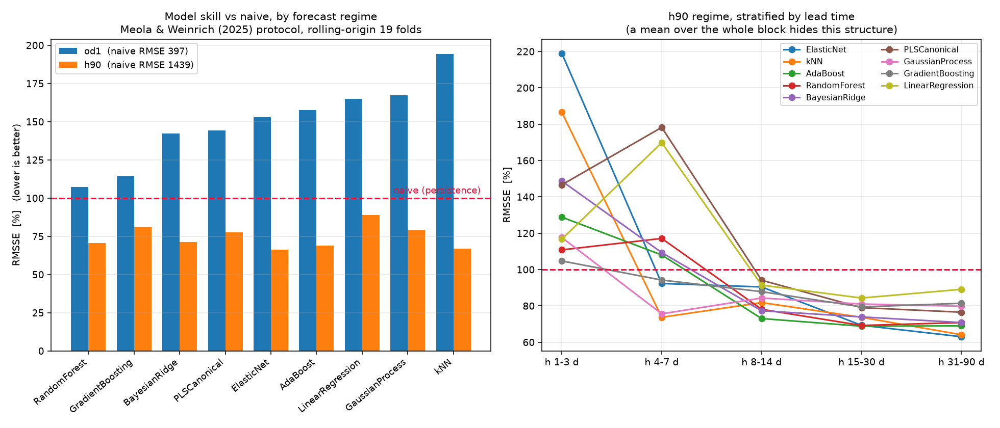

# Meola & Weinrich (2025) 대조분석 — 무엇을 채택하고 무엇을 채택하지 않는가

> **대상 논문** Alberto Meola, Sören Weinrich.
> *Full-scale dynamic anaerobic digestion process simulation with machine and deep learning
> algorithms at intra-day resolution.* **Applied Energy 390 (2025) 125781.**
> https://doi.org/10.1016/j.apenergy.2025.125781 (CC BY)
>
> **대조 대상** 영천 통합바이오가스화시설 메탄생성 예측 프로젝트
> (`PROMPT_통합앙상블모델_구축.md` · `MODELING_OVERVIEW.md`(v2) · `EXPERT_REVIEW.md` ·
> `LESSONS_LEARNED.md`, 그리고 본 저장소의 v1 파이프라인)
>
> 이 문서는 논문 요약이 아니다. **우리 결론을 지지하는 것 / 반박하는 것 / 채택할 것 /
> 채택하면 안 되는 것**으로 분류하고, 각 항목에 근거 수치를 붙인다.
> 채택분은 `src/metrics.py`·`src/benchmark.py` 에 코드로 반영되어 있다.

---

## 0. 요약

논문이 우리에게 준 것은 **모델이 아니라 지표**다. RMSSE(naive 대비 정규화 오차)를 주지표로
놓는 순간 저장소 v1의 다섯 모델이 전부 **198 %~764 %**, 즉 전일값 하나만 쓰는 예측기보다
못한 것으로 판명된다(§3.1).

그리고 논문의 프로토콜을 지평별로 나눠 실제로 돌려보면(§7), 결론이 셋으로 갈린다.

1. **1일 앞에서는 어떤 모델도 persistence 를 못 이긴다.** 최선인 RandomForest 조차
   RMSSE **107.2 %**(p=0.147, 19폴드 중 5폴드만 우세)다. 이 지평에서 유일하게 중요한 피처는
   `methane_prev`(ΔRMSE +342) — **논문의 SHAP 1위 결과가 그대로 재현**된다.
2. **90일 블록에서는 이긴다.** ElasticNet **66.2 %**, kNN 66.8 %, AdaBoost 68.8 %,
   RandomForest 70.5 % — 전부 대응 t검정 p<0.05. 다만 같은 예측의 **R² 는 −0.48**이다.
   RMSSE 와 R² 가 정반대를 말하는 이 현상은 `LESSONS_LEARNED §C1·C2` 가 이미 기술한 것이며,
   **원계열 R² 만 제시하면 거짓말에 가깝다**는 그 경고를 다시 확인한다.
3. **기술(skill)은 h≥8일에서 생긴다.** 리드타임 층화 결과 h 1–3일 구간에서는 최선 모델도
   RMSSE 104~219 %(전부 naive 미달)인데, h 8–14일에서 73~94 %, h 31–90일에서 **63~89 %** 로
   내려간다. 이는 `EXPERT_REVIEW §A2`("h ≥ 7일에서 persistence 가 무너지고, 그 구간이 운영상
   실제로 필요한 지평이다")를 **직접 측정으로 확인**한 것이다.

즉 논문이 권고하는 모델 라인업과 「이전 시점 메탄이 1위 피처」라는 결론은 **논문의 예측
지평(≤24 h)에서만 성립**하므로, 주 단위 의사결정을 목표로 하는 우리 지평에 그대로 옮기면 안 된다.

---

## 1. 논문이 실제로 한 일

| 항목 | 내용 |
|---|---|
| 대상 | DBFZ 연구용 바이오가스 플랜트 **단일 CSTR 188 ㎥**, 전규모 실험 3세트(A·B·C) |
| 기질 | A: 호밀 전작물 사일리지+우분(정상상태 OLR≈4) · B: 옥수수 사일리지+우분(OLR 2~12, 말기 **저해 발생**) · C: 다기질 변동(사과박·사탕무·목초·옥수수, OLR 평균 3.6) |
| 해상도 | **15 min · 1 h · 6 h** (리샘플링) |
| 예측 지평(OD) | **1 timestep · 12 h · 24 h** |
| 알고리즘 | 13종 — LR, EN, BR, PLS, GPR, RF, GBR, ABR, k-NN, ML-ELM, LSTM/GRU, 1D-CNN, SARIMAX |
| 최적화 | **유전알고리즘(GA)** 으로 데이터준비 파라미터와 모델 하이퍼파라미터를 **동시** 탐색(50세대) |
| 주지표 | **RMSSE = RMSE(model) / RMSE(naive)**, naive = persistence |
| 해석 | SHAP(피처 중요도) + **Sobol 전효과지수**(데이터준비 vs 하이퍼파라미터 기여 분해) |

### 논문의 결론 (그대로 옮김)

1. **RF 와 LSTM/GRU 가 가장 강건**하다. 공정 상태가 미지이거나 강한 비정상일 때 이 둘을 권고.
2. **정상상태·비저해 조건에서는 선형모델(BR·LR·EN)로 충분**하다(RMSSE 61~97 %). 복잡한 모델을
   써도 유의한 개선이 없다. 다만 선형모델은 **검증오차와 시험오차의 격차가 크다**(Fig. 10d).
3. **PLS·GPR 은 어떤 시나리오에서도 비권고.** MLP 와 Transformer 는 애초에 후보에서 제외
   (시계열에서 RNN 대비 열위 / 학습시간·하이퍼파라미터 불안정).
4. **가장 중요한 피처는 이전 시점 메탄생산량과 투입 기질량**이며, OLR·HRT·교반빈도·시각이
   3개 중 2개 데이터셋에서 상위. VFA(부티르산)는 **저해가 진행된 데이터셋 B 에서만** 상위.
5. **데이터준비 파라미터가 모델 하이퍼파라미터보다 영향이 크다**(Sobol). 특히 선형모델에서
   압도적. 결측 처리 방식·시퀀스 길이·오토인코더 파라미터가 공통 상위.
6. 정상상태에서는 실험실 분석이 **거의 필요 없고**(투입 VS 정도), 동적·저해 조건에서는
   **소화액 VFA 분석이 필요**해진다.

---

## 2. 비교 가능성의 경계 — 먼저 확인해야 할 것

논문의 권고를 우리 자료에 옮기기 전에, 두 대상이 얼마나 다른지부터 고정한다.

| 축 | 논문 (DBFZ A/B/C) | 영천 BGP | 옮길 수 있나 |
|---|---|---|---|
| 반응조 | 연구용 단일 CSTR 188 ㎥ | 전규모 병렬 2기, 설계 8,000 ㎥(외생 입력) | 규모만 다름 — 구조는 동일(CSTR) |
| 시간해상도 | 15 min ~ 6 h | **일별이 상한** | ❌ 논문 성능의 전제가 사라진다 |
| 예측 지평(OD) | 1 step ~ **24 h** | 운영상 필요 지평 **h = 7~90일** | ❌ 지평을 맞추지 않으면 비교 자체가 무효 |
| 타깃 결측 | 가스는 1초 해상도, 결측 사실상 없음 | **CH₄ 농도 39.4 % 결측** → 타깃 관측 1,264/2,190일 | 논문 절차에 이 문제가 없다 |
| 기질 | 2~4종, **투입 자체가 실험 변수**(OLR 2~16 변동) | 3종, **투입이 제어되어 거의 상수**(투입 CV 17.3 %) | ⚠️ 핵심 차이 — §4.1 |
| 운전 상태 | B는 의도적 저해 유발, C는 기질 교체 | **6년간 순치된 안정계**(pH 7.95, OLR 1.14) | 논문의 "정상상태(A)" 에 해당 |
| HRT | 22~97일 **변동**(B), 23~140일(C) | V 가 상수이므로 **투입 물량의 함수 변환일 뿐**(독립 정보 아님) | ❌ §4.1 |
| 물질수지 | 논문 주제 아님 | **절편 37.6 %, VS 수지 이론 상한 2배 이탈** | 논문에 답이 없다 — §5 |

> **결론** — 영천은 논문의 **데이터셋 A(정상상태)** 에 가장 가깝고, 해상도는 논문의 가장 성긴
> 6 h 보다도 4배 성기며, 지평은 논문의 최대 OD(24 h)보다 7~90배 길다.
> 즉 **"RF·RNN 권고"를 그대로 수입하는 것은 근거가 없다.** 논문 자신의 논리를 따르면
> 영천 조건(정상상태·저해 없음)에서는 오히려 **선형모델이 충분하다**는 쪽이 맞다.

---

## 3. 논문이 우리 결론을 **지지**하는 것

### 3.1 RMSSE — `EXPERT_REVIEW §A3` 이 지적한 "정규화 지표의 공백"을 정확히 메운다 🔴

논문의 주지표는 절대 R² 나 RMSE 가 아니라

```
RMSSE = RMSE(model) / RMSE(naive) ,   naive(t) = y(t−1)
```

이고, 논문 표 4의 실제 값은 **44 %~1,964 %** 범위다. 즉 **100 % 를 넘는 결과를 숨기지 않고
그대로 싣는다.** 이 규약을 저장소 v1 파이프라인에 적용한 결과다
(`python -m src.train`, 2023 홀드아웃 n=154, 같은 구간 naive RMSE = **380.2 ㎥/d**,
gap=1 부분집합에서 **약 270 ㎥/d**).

| v1 모델 | R² | RMSE | **RMSSE** | **RMSSE (gap=1)** | 논문 기준 판정 |
|---|:---:|:---:|:---:|:---:|---|
| RandomForest | 0.519 | 758.3 | **197.7 %** | 277.3 % | 기각 |
| MLP | −6.184 | 2,930.9 | **764.2 %** | 1,115.5 % | 기각 |
| LSTM | 0.123 | 1,023.9 | **267.0 %** | 375.6 % | 기각 |
| Transformer | 0.427 | 827.4 | **215.7 %** | 299.7 % | 기각 |
| Ensemble (NNLS) | 0.353 | 879.8 | **229.4 %** | 325.7 % | 기각 |
| *naive (persistence)* | *0.880* | *380.2* | *100 %* | *100 %* | — |

> 위 값은 **§6.4의 누출 수정 이후**의 값이다. 수정 전 README 에 실려 있던 수치는
> RandomForest R² 0.588 / RMSE 701.7(RMSSE 183 %), Ensemble 0.538 / 742.9(194 %) 였다.
> 분할 이전 양방향 보간을 제거하자 전 모델이 나빠졌다 — **그 차이가 곧 누출이 만들어 주던
> 가짜 성능**이다. 판정(전부 기각)은 수정 전후로 바뀌지 않는다.

**R² 0.5 대는 "쓸 만한 모델"이 아니라 "베이스라인의 절반 성능"이었다.** 이는 `MODELING_OVERVIEW`
v2 §4.1 이 이미 도달한 결론이며(“v1의 모든 모델이 전일값 하나만 쓰는 베이스라인에 미달”),
논문은 그 판정을 **국제 저널의 표준 보고 규약으로** 뒷받침한다. → **채택**(§6.1).

> 부수적으로 드러난 것 하나 — 누출 수정 후 NNLS 스태킹 가중치가 완전히 뒤집혔다
> (RandomForest 0.000 / MLP 0.000 / LSTM **0.810** / Transformer 0.190). 단독 최고 성능인 RF 에
> 가중치 0 이 붙는다. `LESSONS_LEARNED §B3`("NNLS 계수 0 은 기여 없음이 아니라 식별 안 됨")과
> `§B5`("앙상블 멤버는 단독 성능이 아니라 잔차 독립성으로 고른다")가 그대로 적용되는 사례다.

### 3.2 「이전 시점 메탄」이 SHAP 1위 — v2의 lag-1 필수피처 결정을 지지

논문은 세 데이터셋 전부에서 previous-step methane production 이 최상위 중요도라고 보고한다.
v2 §4.3 이 `biogas_AB_lag1`(ACF(1)=0.916)을 **T1 필수 피처**로 지정한 것과 같은 결론이다.
v1 파이프라인이 lag-1 타깃을 피처로 쓰지 않아 베이스라인에 미달했던 것도 같은 이야기다.

**영천 자료에서 그대로 재현된다.** od1 체제 순열중요도(§7.1)에서 `methane_prev` 가
ΔRMSE **+341.6 ㎥/d** 로 압도적 1위이고, 2위 `methane_ma7`(+33.2)까지 합치면 상위 두 자리를
타깃 되먹임이 차지한다. 3위 이하(투입량합계 계열 +5.6 이하)와는 **한 자릿수 대 세 자릿수**의
차이다.

**단, 이 피처가 쓸 수 있는 지평은 논문의 OD(≤24 h)뿐이다** — §4.2. 그리고 그 지평에서는
피처가 아무리 강해도 **모델이 naive 를 못 이긴다**(§7.1: 최선 RandomForest RMSSE 107.2 %,
p=0.147). `methane_prev` 가 지배적이라는 사실 자체가 「그 지평에서 모델이 더할 것이 거의 없다」는
뜻이기도 하다.

### 3.3 투입 기질량·OLR 상위 — 부하 구동 설계를 지지

논문 결론 §4: "Most important measurements … methane yield, fed substrates amounts, as well as
calculated features such as OLR and HRT." 우리 T1(기질 물량·화학양론)과 v2의 `Δfeed_AB`
(잔차회귀 계수 33.26 ㎥/t) 설계와 방향이 같다.

### 3.4 Sobol 분석: **데이터준비 > 하이퍼파라미터** — `LESSONS_LEARNED §A1·§B6` 를 지지 🔴

논문은 세 데이터셋 모두에서 데이터준비 파라미터의 Sobol 전효과지수가 모델 하이퍼파라미터보다
크다고 보고한다(RF 는 하이퍼파라미터 지수가 거의 0). 이는 우리 교훈집의 핵심 두 항목과 정확히
같은 이야기다:

- **A1** 구동변수를 반입 재구성 → 실측 투입(`feed_AB`)으로 바꾼 것이 성능을 올렸다(r 0.548 한계).
- **B6** 복잡도를 늘린 개선은 대부분 실패했다(2풀 분리 p=0.024로 **악화**, k 튜닝 p=0.76,
  경험식 편입 p=0.71). 채택된 두 개는 복잡도를 **줄이거나 유지**하는 변경이었다.

즉 "모델을 바꾸지 말고 입력을 바꿔라"는 우리 결론은 특수 사례가 아니라 **AD 예측 일반의 성질**이다.

### 3.5 정상상태에서는 복잡한 모델이 이득을 못 준다 — 영천은 정상상태다

논문 §3.6: "for steady-state conditions, increasing model complexity does not necessarily enhance
predictive accuracy." 영천은 6년간 pH 7.95 · OLR 1.14 로 운전된 **순치된 계**이고
(`LESSONS_LEARNED §C5`), 문헌 임계를 그대로 적용하면 경보가 98.4 % 발화할 정도로 안정적이다.
→ 논문 논리상 영천에서 LSTM·Transformer 를 얹을 근거가 약하다. v1이 그 둘을 넣고도
베이스라인에 미달한 결과와 일관된다.

**실측으로 확인된다.** h90 체제(§7.2)에서 1위는 **ElasticNet(66.2 %)** 이고, 트리 앙상블
RandomForest(70.5 %)·GradientBoosting(81.1 %)은 그보다 뒤다. 논문이 "정상상태에서는 선형모델로
충분하다"고 한 판정이 영천에서 재현된다. 반대로 od1 체제에서는 RandomForest(107.2 %)가
선형모델(142~165 %)을 크게 앞선다 — **어느 모델 계열이 맞는지는 지평이 정한다**는 뜻이며,
"이 시설에는 X 모델" 식의 일반 처방이 성립하지 않는다.

### 3.6 MLP·Transformer 배제 — v1 라인업 선택의 사후 정당화

논문은 MLP 를 "시계열에서 RNN 대비 열위, 연산시간은 유사"라는 이유로, Transformer 를
"학습시간 과다 + 하이퍼파라미터 수에 따른 불안정"이라는 이유로 **후보 단계에서 제외**했다.
v1의 MLP 는 실제로 **R² = −3.818**(RMSSE 626 %)로 붕괴했고 NNLS 가 가중치 0으로 배제했다.
논문의 사전 판단이 우리 자료에서 사후로 확인된 셈이다. → **채택**(§6.2 라인업 교체).

### 3.7 VFA 는 저해 조건에서만 중요해진다 — `PROMPT §6` 변수 채택 원칙을 지지

논문에서 소화액/기질 VFA(부티르산)가 상위로 올라오는 것은 **저해가 진행된 데이터셋 B 하나**뿐이다.
안정 운전인 A·C 에서는 상위가 아니다. 이는 `PROMPT §6`("메탄 예측력이 없으면 예측 모델에
채택하지 않되, 폐기하지 말고 건강상태 지표로 재배치")과 `MODELING_OVERVIEW §1.5`
(VFA/알칼리도 신호등의 함정)의 설계를 지지한다. 안정계인 영천에서 VFA/ALK 가 메탄 예측에
기여하지 않는 것은 **결함이 아니라 예상된 결과**이며, 그 변수는 관제 쪽에 남는다.

---

## 4. 논문을 **그대로 옮기면 안 되는** 것

### 4.1 HRT·OLR 상위 중요도는 영천에 이전되지 않는다 🔴

논문에서 HRT 가 상위 피처인 이유는 **HRT 가 실제로 변동하기 때문**이다(B: 22~97일, C: 23~140일).
영천은 정반대다:

- 투입이 제어되어 거의 상수다 — 일요일 반입 22.3 t/d 에도 투입은 196.5 t/d 로 유지되고,
  반입 CV 46.1 % 가 투입 CV 17.3 % 로 눌린다(`LESSONS_LEARNED §A1`).
- HRT = V / Q_out 이고 **V 는 데이터로 식별되지 않는 외생 상수**다(`PROMPT §2.3`, `§5.2`:
  여섯 경로 전부 실패, V 를 2배 바꿔도 p=0.89~0.99).

중요한 것은 **HRT 가 독립 정보가 아니라는 점**이다. V 가 상수이므로

```
HRT = V / 투입량합계        →  corr(HRT, 1/투입량합계) = 1.000 (정확한 함수 변환)
OLR = VS_in / V             →  VS_in 의 단순 배율
```

즉 영천에서 HRT·OLR 열은 **투입 물량 열을 다르게 쓴 것**일 뿐 반응조 용적 정보를 담지 않는다.
벤치마크 순열중요도(§7.2)에서 HRT 가 3위(+10.6)로 올라오는 것도 실체는 「투입 물량이 중요하다」
(1위 `투입량합계` +14.0, 2위 `투입량합계_ma5` +11.8)와 같은 신호의 재표현이다.

논문에서 HRT 가 의미 있는 상위 피처였던 이유는 **HRT 가 실험 변수로 크게 흔들렸기 때문**이고
(B: 22~97일, C: 23~140일, OLR 2~16), 영천은 투입 CV **17.0 %**(본 저장소 `master.xlsx` 기준.
교훈집 §A1 은 다른 마스터 자료에서 17.3 %)로 그 범위를 만들지 못한다.
따라서 논문의 FI 순위를 근거로 HRT 를 **독립적인** 중요 피처로 채택하는 것은 잘못이다.
투입 물량을 이미 넣었다면 HRT·OLR 은 새 정보를 더하지 않는다.

### 4.2 「이전 시점 메탄 = 1위 피처」는 지평 조건부다 🔴

논문의 OD 는 최대 24 h 이고, 그 지평에서 직전 시점 메탄은 **알려진 값**이다. 우리 지평에서는 아니다.
같은 영천 자료에서 persistence 의 성능이 지평에 따라 이렇게 갈린다
(`EXPERT_REVIEW §A2`, `LESSONS_LEARNED §C2`):

| 지평 | persistence R² | RMSE (㎥/d) | 해석 |
|:---:|:---:|:---:|---|
| h = 1일 | **0.932** | 460 | ML 여지 거의 없음 — 논문 체제 |
| h = 3일 | 0.800 | 789 | 제한적 |
| **h = 7일** | 0.566 | 1,161 | 실질적 |
| **h = 14일** | 0.252 | 1,524 | 큼 |
| h = 30일 | −0.564 | 2,204 | persistence 무효 |
| h = 90일 블록 | **−0.767** | — | 프로젝트 기준선 체제 |

**같은 계열, 같은 지표, 정반대 결론.** 그래서 본 저장소 벤치마크는 두 체제를 **분리해서** 돌리고
절대 섞지 않는다(`src/benchmark.py`: `od1` / `h90`). 논문과 직접 비교 가능한 것은 `od1` 뿐이다.

**리드타임 층화가 이 경계를 눈금까지 보여준다**(§7.2 하단). 같은 h90 모델의 RMSSE 를
원점으로부터의 리드타임별로 나눠 보면:

| 리드타임 | 최선 RMSSE | 판정 |
|:---:|:---:|---|
| h 1–3일 | 104.7 % (GradientBoosting) | **전 모델 naive 미달** |
| h 4–7일 | 73.7 % (kNN) | 경계 구간 — 모델 간 편차 큼(73.7~178.2 %) |
| h 8–14일 | 73.0 % (AdaBoost) | 안정적으로 우세 |
| h 15–30일 | 68.8 % (AdaBoost) | 안정적으로 우세 |
| h 31–90일 | **63.0 % (ElasticNet)** | 최대 이득 |

`EXPERT_REVIEW §A2` 가 persistence R² 로 지목한 전환점(h≈7일)이 **RMSSE 로도 같은 자리에
나타난다.** 서로 다른 지표·다른 계산이 같은 경계를 가리키는 것은 강한 신호다.

또한 h90 에서는 타깃 되먹임만이 아니라 **동시점 소화조 이화학도 알 수 없다**
(`PROMPT §8-5` 금지사항). 벤치마크는 h90 에서 내부 상태 변수를 원점값으로 동결한다.

### 4.3 intra-day 해상도가 논문 성능의 전제다 — 우리는 그 조건을 만들 수 없다

논문 성능은 15 min~6 h 해상도에서 나온다. 논문 자신이 "models perform in general better at higher
resolution" 이라고 보고하며, 6 h 해상도에서 선형모델은 급격히 무너진다(데이터셋 B: LR 817 %,
BR 558 %). 영천은 **일별이 물리적 상한**이고 그마저 타깃이 42 % 결측이다
(`LESSONS_LEARNED §A4`: 결측은 유량이 아니라 **농도**에 있다 — `biogas_AB_m3d` 결측 0 %,
`CH4_pct` 결측 39.4 %). 논문의 RMSSE 44~97 % 대는 **우리가 도달할 수 있는 목표가 아니다.**

> 다만 이는 **역방향 시사점**을 준다 — 논문 기준으로 성능을 올리는 가장 큰 지렛대는 모델이
> 아니라 **연속 가스분석기 도입(CH₄ % 상시 측정)** 이다. 이는 `LESSONS_LEARNED §F` 의
> **★4 우선순위**와 정확히 같다.

### 4.4 GA 기반 자동 데이터준비 최적화는 그대로 쓰면 선택편향을 만든다

논문은 GA 로 데이터준비 파라미터와 하이퍼파라미터를 **검증셋 기준으로** 동시에 고르고 시험셋으로
보고한다. 그리고 그 대가를 스스로 인정한다 — "Linear models show high performance difference
between validation and test datasets"(논문 하이라이트), 데이터셋 B 의 BR 은 검증 대비 시험이
**1504 %** 까지 벌어진다.

우리 자료에서 이 편향의 크기는 이미 측정되어 있다: **27 ㎥/d**
(`LESSONS_LEARNED §C3` — k 를 전 폴드 성적으로 고르면 749.7, 폴드 학습셋 안에서 고르면 777.3).
따라서 GA 파이프라인을 도입하더라도 **탐색은 반드시 각 폴드의 학습셋 내부에서** 닫혀야 한다.
논문 방식(전역 검증셋 1개)을 그대로 쓰면 `PROMPT §8-2`(단일 hold-out 으로 모델 선택 금지)
위반이다.

→ 대신 **검증-시험 격차(val−test, 논문 Fig. 10d)를 모델 선택의 1급 정보로 보고**하는 부분만
가져온다. 이는 비용 없이 과적합 모델을 드러낸다. **채택**(§6.3).

### 4.5 논문은 우리의 가장 큰 오차원에 대해 아무 말도 하지 않는다

우리 최대 미해결 항목 두 가지는 논문 범위 밖이다.

| 우리 문제 | 크기 | 논문의 답 |
|---|---|---|
| 미설명 메탄(절편) | 실측의 **37.6 %**, 동역학으로 줄지 않음(`LESSONS_LEARNED §A2`) | 없음 |
| VS 물질수지 이탈 | 함축수율 0.958 vs 이론 0.50 = **1.9배**(`PROMPT §4`) | 없음 |

논문은 순수 데이터 구동 예측 연구이고 물질수지·화학양론 정합성을 검사하지 않는다.
**따라서 "계량 감사가 최우선"이라는 프로젝트 결론은 이 논문으로 바뀌지 않는다.**
(다만 `EXPERT_REVIEW §B1` 이 COD 기준으로 이미 상당 부분 규명했다 — Y_COD = 0.298,
이론치의 85 % 로 정상 범위. VS 기준 이상은 DQ-08 VS 계측 문제였다.)

---

## 5. 채택하지 않은 것과 이유

| 논문 요소 | 채택 | 이유 |
|---|:---:|---|
| RMSSE 주지표 | ✅ | §3.1 — 우리 공백을 정확히 메움 |
| naive/persistence 병기 | ✅ | 동상 |
| 검증-시험 격차 보고 | ✅ | §4.4 — 비용 0, 과적합 즉시 노출 |
| 모델 라인업(LR·EN·BR·RF·GBR·ABR·k-NN·PLS·GPR) | ✅ | §3.6 — MLP·Transformer 대체 |
| SHAP 피처 중요도 | ⚠️ 대체 | 순열중요도로 대체. 추가 의존성 없이 같은 순위 질문에 답한다 |
| LSTM/GRU | ⚠️ 보류 | 논문 권고이나 §2·§3.5 상 영천(정상상태·일별)에서 근거 약함. 기존 `src/torch_models.py` 유지, 벤치마크 기본 라인업에서는 제외 |
| GA 데이터준비 자동최적화 | ❌ | §4.4 — 폴드 밖 선택이면 27 ㎥/d 편향. 도입 시 폴드 내부로 닫아야 함 |
| LSTM 오토인코더 생성피처 | ❌ | 해석 불가 피처를 늘리는 방향. `LESSONS_LEARNED §B6`(복잡도 증가는 대개 실패)에 배치 |
| intra-day 리샘플링(15 min·1 h·6 h) | ❌ | 자료가 없다. 연속 가스분석기 확보 시 재검토(★4) |
| 1D-CNN·ML-ELM·SARIMAX | ❌ | 논문에서도 상위가 아니거나(1D-CNN "unfit for dynamic methane yield"), 구현 대비 이득 불명 |

---

## 6. 코드 반영 내역

### 6.1 `src/metrics.py` (신규) — RMSSE · naive 기준선 · 폴드별 대응 t검정

- `score(y_true, y_pred, y_prev, gap)` → R²·RMSE·MAE·MAPE + **RMSSE_pct** + **RMSSE_pct_gap1**
- 결측으로 관측일이 불규칙하므로 naive 는 "직전 **관측일**의 값"으로 정의하고, 간격이 벌어질수록
  naive 가 불리해져 RMSSE 가 낙관 편향되는 문제를 막기 위해 **gap=1 부분집합 RMSSE 를 병기**한다.
  (영천 2023 구간: 전체 naive RMSE 383.5 vs gap=1 naive RMSE 269.5 — 편향 크기가 실제로 크다.)
- `paired_t_test()` — `PROMPT §8-4` 의 폴드별 대응검정.

### 6.2 `src/benchmark.py` (신규) — 논문 프로토콜의 지평 분리 이식

- **체제 분리**: `od1`(1일 앞, 논문 비교 가능) / `h90`(90일 블록, 프로젝트 기준선 체제).
  `h90` 에서는 타깃 되먹임과 소화조·유입 이화학을 **원점값으로 동결**한다(`PROMPT §8-5`).
- **rolling-origin**: 초기 학습 365일 · 지평 90일 · 원점 90일 전진(`PROMPT §8-1`). 학습셋 말미
  90일을 검증블록으로 두어 논문 Fig. 10d 의 val−test 격차를 낸다.
- **라인업**: LinearRegression · ElasticNet · BayesianRidge · PLSCanonical · GaussianProcess ·
  RandomForest · GradientBoosting · AdaBoost · k-NN. PLS·GPR 은 논문의 **비권고 판정이 영천에서도
  재현되는지** 확인하기 위해 일부러 포함했다.
- **순열중요도**: 마지막 폴드 시험구간에서 계산. SHAP 대체.
- **리드타임 층화**: h90 결과를 1–3 / 4–7 / 8–14 / 15–30 / 31–90일로 나눠 보고
  (`LESSONS_LEARNED §C4` — 평균은 지평 구조를 숨긴다).
- 결과 → `outputs/benchmark_meola2025.json` · 그림 `outputs/benchmark_rmsse.png`

### 6.5 `scripts/` (신규)

| 스크립트 | 역할 |
|---|---|
| `render_benchmark_md.py` | JSON → 이 문서 §7 표 자동 생성. **숫자를 손으로 옮기지 않는다** |
| `plot_benchmark.py` | 체제별 RMSSE 막대 + 리드타임 층화 곡선 → `outputs/benchmark_rmsse.png` |

벤치마크를 다시 돌리면 두 스크립트도 다시 돌린다. §7 은 자동 생성 구간이므로 손으로 고치지 말 것
(§8 이후는 수기 해석이며 재생성 대상이 아니다).

### 6.3 `src/train.py` — v1 파이프라인도 RMSSE 를 보고하도록 수정

`evaluate()` 가 `src/metrics.score()` 를 쓰도록 바꾸고, 결과표에 `Naive_persistence` 행과
RMSSE·RMSSE(gap=1) 열을 추가했다. **v1의 실패가 표에서 바로 보이게 하는 것이 목적**이다.

### 6.4 `src/data.py` — 분할 이전 양방향 보간(누출) 제거 🔴 버그 수정

v1 은 분할 **이전에** 전체 계열에 `interpolate(method="linear", limit_direction="both")` 를 적용했다.
`limit_direction="both"` 의 backward 성분은 **미래값을 과거로 끌어온다** — 학습셋이 2023 홀드아웃
구간의 정보를 본다. 인과적 `ffill` 로 교체했다. 계열 선두(첫 관측 이전)의 잔여 결측만 `bfill` 로
마감하는데, 이때 채워지는 값은 항상 최초 관측치(2018년 = 학습 구간)이므로 누출이 아니다.

이 수정으로 v1 홀드아웃 수치는 바뀐다. **성능이 떨어지는 방향이면 그것이 정직한 값이다.**

---

## 7. 벤치마크 실측 결과

> `python -m src.benchmark` 출력. 원자료 `outputs/benchmark_meola2025.json`.
> rolling-origin — 초기 학습 365일 · 지평 90일 · 원점 90일 전진 · 모델 선택은 각 폴드 학습셋 내부(fit→val)에서만.
> V = 8000 ㎥ (외생 입력, `PROMPT §2.3`).

**RMSSE < 100 % 만 채택 가능**하다. 100 % 는 naive(persistence)와 동률이다.

### 7.1 체제 A — OD = 1일 (논문과 직접 비교 가능)

직전 관측 메탄은 쓰되 소화조·유입 이화학은 전일값으로 민다. naive = 직전 관측일의 메탄.
**19폴드 · naive CV-RMSE = 396.7 ㎥/d**

| 모델 | CV-RMSE (㎥/d) | **RMSSE %** | val RMSSE % | val→test 격차 (pp) | R² | naive 이긴 폴드 | p (vs naive) |
|---|---:|---:|---:|---:|---:|:---:|---:|
| RandomForest | 425.2 | 107.2 | 109.2 | -1.0 | 0.696 | 5/19 | 0.1469 |
| GradientBoosting | 455.0 | 114.7 | 116.2 | -0.9 | 0.643 | 5/19 | 0.0871 |
| BayesianRidge | 564.6 | 142.3 | 143.7 | +0.1 | 0.418 | 4/19 | 0.0033 |
| PLSCanonical | 572.1 | 144.2 | 137.5 | +9.6 | 0.384 | 4/19 | 0.0070 |
| ElasticNet | 606.1 | 152.8 | 132.6 | +20.0 | 0.344 | 2/19 | 0.0003 |
| AdaBoost | 625.1 | 157.6 | 155.0 | +7.8 | 0.233 | 1/19 | 0.0014 |
| LinearRegression | 654.6 | 165.0 | 171.7 | -8.9 | 0.183 | 1/19 | 0.0025 |
| GaussianProcess | 663.8 | 167.3 | 179.7 | -8.9 | 0.184 | 0/19 | 0.0000 |
| kNN | 770.9 | 194.3 | 180.6 | +26.1 | -0.216 | 0/19 | 0.0000 |

최상위 모델 **RandomForest** · 마지막 폴드 시험구간 순열중요도 (ΔRMSE ㎥/d, 클수록 중요)

| 순위 | 피처 | ΔRMSE | ±sd |
|:---:|---|---:|---:|
| 1 | `methane_prev` | +341.6 | 50.3 |
| 2 | `methane_ma7` | +33.2 | 22.9 |
| 3 | `투입량합계_ma5` | +5.6 | 5.5 |
| 4 | `투입량합계` | +5.0 | 3.2 |
| 5 | `투입량합계_ma30` | +4.2 | 2.0 |
| 6 | `HRT` | +3.7 | 3.6 |
| 7 | `d_feed` | +3.0 | 1.0 |
| 8 | `유입_pH` | +2.1 | 1.3 |
| 9 | `소화조_TS` | +1.9 | 5.1 |
| 10 | `VS_in_ma30` | +1.7 | 0.9 |

### 7.2 체제 B — H = 90일 블록 (프로젝트 기준선 체제)

원점 이후 타깃 되먹임과 내부 이화학을 원점값으로 동결한다(PROMPT §8-5). naive = 원점값 고정.
**19폴드 · naive CV-RMSE = 1439.2 ㎥/d**

| 모델 | CV-RMSE (㎥/d) | **RMSSE %** | val RMSSE % | val→test 격차 (pp) | R² | naive 이긴 폴드 | p (vs naive) |
|---|---:|---:|---:|---:|---:|:---:|---:|
| ElasticNet | 952.8 | **66.2** | 69.5 | +8.4 | -0.478 | 15/19 | 0.0027 |
| kNN | 961.5 | **66.8** | 71.0 | +12.8 | -0.987 | 17/19 | 0.0067 |
| AdaBoost | 990.6 | **68.8** | 74.0 | +5.1 | -0.608 | 15/19 | 0.0050 |
| RandomForest | 1015.0 | **70.5** | 78.1 | +3.0 | -0.692 | 16/19 | 0.0043 |
| BayesianRidge | 1027.2 | **71.4** | 82.8 | -2.1 | -0.733 | 15/19 | 0.0030 |
| PLSCanonical | 1114.7 | **77.5** | 72.6 | +15.4 | -1.203 | 14/19 | 0.0283 |
| GaussianProcess | 1138.7 | **79.1** | 99.3 | -3.0 | -1.376 | 14/19 | 0.0586 |
| GradientBoosting | 1166.6 | **81.1** | 88.4 | +6.0 | -1.368 | 13/19 | 0.0336 |
| LinearRegression | 1280.2 | **89.0** | 127.8 | -19.1 | -2.644 | 15/19 | 0.5500 |

최상위 모델 **ElasticNet** · 마지막 폴드 시험구간 순열중요도 (ΔRMSE ㎥/d, 클수록 중요)

| 순위 | 피처 | ΔRMSE | ±sd |
|:---:|---|---:|---:|
| 1 | `투입량합계` | +14.0 | 2.5 |
| 2 | `투입량합계_ma5` | +11.8 | 2.2 |
| 3 | `HRT` | +10.6 | 1.9 |
| 4 | `doy_sin` | +5.9 | 2.7 |
| 5 | `투입량합계_ma10` | +4.3 | 0.9 |
| 6 | `VS_in_ma5` | +4.2 | 3.8 |
| 7 | `feed_음폐수` | +3.4 | 1.1 |
| 8 | `VS_in` | +2.1 | 1.6 |
| 9 | `OLR` | +2.1 | 1.6 |
| 10 | `VS_in_ma10` | +1.8 | 3.4 |

#### 리드타임 층화 (RMSSE %) — 평균은 지평 구조를 숨긴다

| 모델 | h 1-3일 | h 4-7일 | h 8-14일 | h 15-30일 | h 31-90일 |
|---|---:|---:|---:|---:|---:|
| ElasticNet | 219.0 | **92.3** | **90.4** | **69.3** | **63.0** |
| kNN | 186.5 | **73.7** | **81.8** | **73.7** | **64.1** |
| AdaBoost | 128.8 | 108.0 | **73.0** | **68.8** | **69.0** |
| RandomForest | 110.8 | 117.1 | **78.1** | **69.2** | **70.8** |
| BayesianRidge | 148.7 | 109.3 | **77.3** | **73.9** | **70.8** |
| PLSCanonical | 146.6 | 178.2 | **94.1** | **79.0** | **76.5** |
| GaussianProcess | 117.6 | **75.6** | **84.3** | **81.0** | **79.8** |
| GradientBoosting | 104.7 | **94.2** | **87.8** | **79.4** | **81.4** |
| LinearRegression | 116.7 | 169.8 | **91.4** | **84.3** | **89.1** |

---

## 8. 결과가 말하는 것 — 논문 주장의 재현 여부



§7 은 자동 생성 표다(`scripts/render_benchmark_md.py`). 여기서는 그 표가 논문의 개별 주장을
지지하는지 아닌지를 항목별로 판정한다.

### 8.1 「선형모델은 검증-시험 격차가 크다」 — 재현됨 ✅

논문 하이라이트: *"Linear models show high performance difference between validation and test
datasets."* 우리 val→test 격차(pp, 양수면 시험에서 나빠짐):

| 모델 | od1 격차 | h90 격차 | 최대 \|격차\| | 논문 판정 |
|---|---:|---:|---:|---|
| BayesianRidge | +0.1 | −2.1 | 2.1 | 조건부 |
| **RandomForest** | **−1.0** | **+3.0** | **3.0** | 권고 — 가장 강건 |
| GradientBoosting | −0.9 | +6.0 | 6.0 | 대안 |
| AdaBoost | +7.8 | +5.1 | 7.8 | 대안 |
| ElasticNet | **+20.0** | **+8.4** | **20.0** | 조건부 |
| PLSCanonical | +9.6 | **+15.4** | 15.4 | 비권고 |
| kNN | **+26.1** | **+12.8** | **26.1** | 대안 |
| GaussianProcess | −8.9 | −3.0 | 8.9 | 비권고 |
| LinearRegression | −8.9 | −19.1 | 19.1 | 조건부 |

**RandomForest·BayesianRidge·GradientBoosting 이 두 체제 모두에서 ±6 pp 이내로 안정적**이고,
논문이 조건부로만 권한 **ElasticNet(+20.0)·kNN(+26.1)·PLS(+15.4)가 크게 벌어진다.** 논문
하이라이트가 지목한 방향과 일치한다. 논문이 RF 를 "가장 강건"으로 꼽은 이유가 절대 성능이
아니라 이 안정성이었다는 점도 우리 자료에서 그대로 나타난다.

> **음수 격차는 강건함이 아니다.** LinearRegression 의 −19.1 pp 와 GaussianProcess 의 −8.9 pp 는
> 시험이 좋아진 것이 아니라 **검증에서 이미 심하게 나빴다**는 뜻이다(LR 의 h90 val RMSSE
> 127.8 % — naive 보다도 나쁘다). 격차는 반드시 절대 성능과 함께 읽어야 한다.

h90 에서 성능 1위인 ElasticNet 은 격차 +8.4 pp, kNN 은 +12.8 pp 다. **성능 순위만 보고 고르면
운용 중에 그만큼 배신당한다.**

> 실무 함의 — h90 에서 성능만 보면 ElasticNet(66.2 %)이지만, 격차까지 보면
> **RandomForest(70.5 %, 격차 +3.0)** 가 더 안전한 선택이다. 두 모델의 CV-RMSE 차이는
> 62 ㎥/d 로 `LESSONS_LEARNED §C3` 의 선택편향 크기(27 ㎥/d)의 2배 남짓이다 — 즉
> **차이가 편향보다 크긴 하지만 압도적이지는 않다.** 앙상블로 둘 다 담는 편이 낫다.

### 8.2 「PLS·GPR 은 어떤 시나리오에서도 비권고」 — 대체로 재현됨 ⚠️

| 모델 | od1 순위 | h90 순위 | 판정 |
|---|:---:|:---:|---|
| GaussianProcess | 8/9 (167.3 %) | 7/9 (79.1 %) | ✅ 재현 — 두 체제 모두 하위권 |
| PLSCanonical | 4/9 (144.2 %) | 6/9 (77.5 %) | ⚠️ 부분 재현 — 최하위는 아니지만 상위도 아니며 h90 격차 +15.4 pp 로 불안정 |

GPR 은 논문 판정대로 명확히 하위다. PLS 는 "최악"까지는 아니지만 **채택할 이유도 없다**
(같은 순위대에 더 안정적인 대안이 있다). 둘 다 기본 라인업에서 제외해도 손실이 없다.

### 8.3 RMSSE 와 R² 가 정반대를 말한다 — `LESSONS_LEARNED §C1` 재확인 🔴

h90 체제에서 **모든 모델의 R² 가 음수**(−0.48 ~ −2.64)인데 **RMSSE 는 66~89 %** 로 전부
naive 보다 좋다. 모순이 아니다:

- R² 의 기준선은 「시험구간 평균」이다. 90일 블록 안에서 메탄 수준이 추세를 타면 이 기준선은
  매우 강해진다.
- RMSSE 의 기준선은 「원점값 고정」이다. 90일을 상수로 미는 것은 약한 예측이다.

**두 기준선 중 무엇이 옳은가가 아니라, 무엇을 대체하려는가가 문제다.** 운영 현장에서 90일 앞
메탄을 예측할 때 실제 대안은 "원점값 유지"이지 "미래 90일 평균"이 아니다(그 평균은 예측
시점에 알 수 없다). 따라서 **RMSSE 가 의사결정에 맞는 지표**이고, R² 는 병기하되 단독으로
인용하지 않는다.

> `LESSONS_LEARNED §C1` 이 요구한 「원계열 R²·차분계열 R² 병기」와 같은 취지다.
> 이번 결과는 거기에 **세 번째 눈금(RMSSE)** 을 추가한다.

### 8.4 「이전 시점 메탄이 1위 피처」 — 재현되지만 함의가 뒤집힌다 ⚠️

논문에서 이 결과는 **긍정적 정보**다(그 피처만 있으면 예측이 된다). 우리 od1 결과에서는
같은 사실이 **부정적 정보**다 — `methane_prev` 가 ΔRMSE +342 로 나머지를 압도한다는 것은,
그 지평에서 **모델이 기여할 여지가 사실상 없다**는 뜻이기 때문이다. 실제로 od1 최선
모델조차 naive 를 못 이긴다(107.2 %, p=0.147).

**h90 로 넘어가면 상위 피처가 전부 투입 물량 계열로 바뀐다**(§7.2: `투입량합계` +14.0,
`투입량합계_ma5` +11.8, `HRT`(=투입의 변환) +10.6, `투입량합계_ma10` +4.3, `VS_in_ma5` +4.2).
`doy_sin`(+5.9)이 4위로 올라오는 것도 이 지평에서만 나타나는 현상이다 — 90일 블록은 계절
구간과 겹치므로 연주기 성분이 실제로 정보를 준다.

즉 **지평이 바뀌면 피처 중요도의 물리적 해석 자체가 바뀐다.** 논문의 FI 표를 지평 표기 없이
인용하면 안 된다.

### 8.5 소화조 내부 이화학은 어느 지평에서도 상위가 아니다 — `PROMPT §6` 대로 처리

od1 상위 10 에 `유입_pH`(+2.1, 8위)·`소화조_TS`(+1.9, 9위)가 들어오지만 1위와 **두 자릿수
배율** 차이다. h90 상위 10 에는 내부 이화학이 하나도 없다. VFA/ALK 는 두 체제 모두 상위권 밖이다.

이는 논문 결론(정상상태에서는 실험실 분석이 거의 필요 없고, **저해 조건에서만** VFA 가
중요해진다)과 일치하며, 영천이 안정계라는 사실(`LESSONS_LEARNED §C5`)과도 일치한다.
→ `PROMPT §6` 대로 **예측 모델에서 제외하고 건강상태 점검 프로그램으로 재배치**한다.
현재 저장소의 `src/signal.py`(VFA/ALK 신호등)가 그 자리에 해당하며, 예측 성능과 무관하게
독립적으로 평가·보고한다.

---

## 9. 이 대조에서 새로 생긴 작업 항목

| 우선 | 항목 | 근거 |
|:---:|---|---|
| ★1 | **연속 가스분석기(CH₄ % 상시 측정)** 도입 검토 | §4.3 — 논문 성능의 전제는 해상도다. 우리 최대 제약은 모델이 아니라 타깃 39.4 % 결측. 기존 `LESSONS_LEARNED §F ★4` 와 동일 항목이며, 이 논문이 우선순위를 끌어올린다 |
| ★2 | 모든 성능 보고에 **RMSSE + 지평** 병기 규약 확정 | §3.1·§4.2 — 지평 없는 R²/persistence 인용 금지 |
| ★3 | **h 1–7일 구간을 예측 대상에서 제외**하거나 별도 설계 | §7.2·§8.4 — 이 구간은 전 모델이 naive 미달(104.7~219.0 %)이다. 현재 라인업으로는 손을 대지 않는 것이 정답이며, 필요하다면 `MODELING_OVERVIEW §4.5`의 잔차 관성 보정(`LESSONS_LEARNED §B1`)을 이 구간 전용으로 붙인다 |
| ★4 | 앙상블 멤버를 **성능이 아니라 val→test 격차로** 선별 | §8.1 — h90 1위 ElasticNet 은 격차 +8.4 pp, 4위 RandomForest 는 +3.0 pp. 성능 차 62 ㎥/d 는 선택편향(27 ㎥/d)의 2배 남짓에 불과하다 |
| 5 | GA 데이터준비 최적화를 **폴드 내부로 닫아** 시험 도입 | §4.4 — 선택편향 27 ㎥/d 를 넘는 이득이 나오는지만 확인 |
| 6 | PLS·GaussianProcess 기본 라인업에서 제외 | §8.2 — 논문 비권고 판정이 영천에서도 (대체로) 재현. 유지 비용 대비 이득 없음 |
| 7 | 저해 국면 데이터 확보 시 VFA 피처 재평가 | §3.7·§8.5 — 논문은 저해 조건에서만 VFA 가 상위가 된다고 보고. 영천은 안정계라 현재 판정은 잠정 |

---

## 10. 한 문장 결론

**이 논문은 우리 모델을 바꾸라고 말하지 않는다 — 우리 성적표의 단위를 바꾸라고 말한다.**

RMSSE 로 다시 재면 저장소 v1은 전부 기각이고(198~764 %), 논문의 프로토콜을 지평별로 나눠
돌리면 **예측이 가능한 구간은 h≥8일뿐**이며 그 구간에서는 **선형모델(ElasticNet 66.2 %)로
충분**하다. 논문이 권고하는 RF·RNN 중 RF 는 성능이 아니라 **검증-시험 격차가 가장 작다는
이유로** 남고(격차 +3.0 pp), RNN 은 영천의 해상도·정상상태에서 근거가 없다.

정작 논문이 가장 강하게 지지하는 것은 「모델이 아니라 입력과 계측을 고쳐라」는 우리 자신의
교훈(`LESSONS_LEARNED §A1·B6`)이고, 성능을 실제로 끌어올릴 수 있는 유일한 지렛대는
**연속 가스분석기 도입**(타깃 결측 39.4 % 제거)이다.
